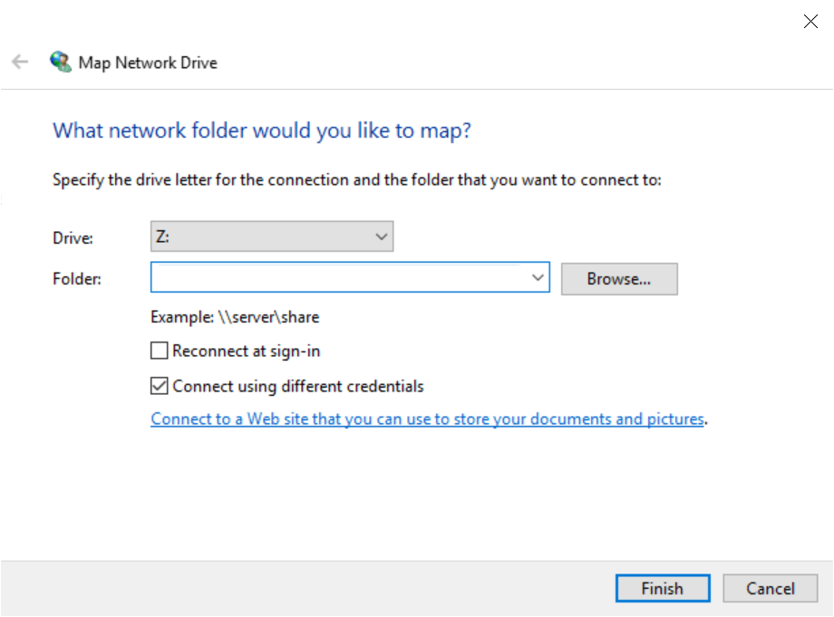

# WebDAV Server

WebDAV is a protocol for transfering files to and from a server.

The primary goal of this project is to make it easy for people to interact with PVC's by allowing you to map them as a drive to Windows.

## Introduction

This repo contains a simple node project that will allow you to build the WebDAV image and deploy a WebDAV pod using one of the provided templates.

## Buiding and Deploying a WebDAV Server

In order to build and deploy your own WebDAV server you will need to first configure the build process, and you can then utilize the provided templates to deploy a running instance of WebDAV.

Specific instructions for building and deploying this project can be found in the respective directories:
* [node](node) (NodeJS s2i)
* [apache](apache) (Apache base image)

The apache image has the ability to serve out files via regular HTTP requests

## Mounting the Drive in Windows

1) Open the `Windows File Explorer` and select `This PC` from the left panel.
2) Select the `Computer` menu from the ribbon and click on `Map Network Drive`.
3) Paste the Route for the WebDAV server into the `Folder` field and check the box for `Connect using different credentials`.  Click `Finish`.

4) Enter the username and password from the WebDAV environment variables and click `ok`. 

The drive should now be accessible from your Windows machine.